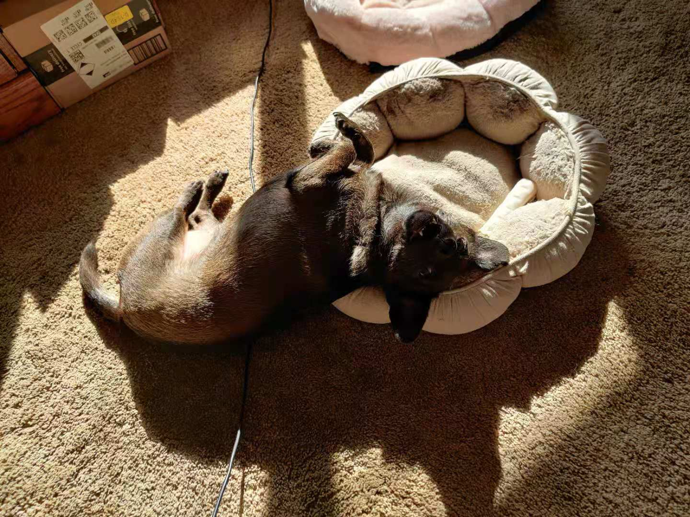

 # Jasmine's User Page 
 
### Who am I ???
> ~~I'm a lazy person with nothing excellent but beauty and wisdom.~~
**Just kidding**
I'm a fourth year undergraduate student at UCSD. But this is my first year on campus. My major is CS and I like to learn new stuff.
 
### As a person
I am 
```
optimistic
enjoy life
emotional
```
 
Things I like to do
- drawing
- playing the guitar
- staying at home
- playing mobile games
- thinking about future
  

### Then My Pet!!!
I have a really lovely dog, her name is Riki.

 

 

 
### **Now** As a programmer
I am 
```
patient
good at thinking
However not good at communication
```
 
Fields I'm interested in
1. Software Engineering
2. UI/UX Design
3. Computer Graphic

*(The number is my interested level)*
 
Besides class project, the only project I did is right [here](https://github.com/JingxianW/WeatherAppProject).
 
My plan to be a better programmer
- [ ] Complete every homework
- [ ] Study leetcode questions
- [ ] Work on projects
  - In class project
  - Outside class project
- [ ] Learn communication and teamwork skill

[In the end, want to see my dog again?](#my-pet)
 
 

